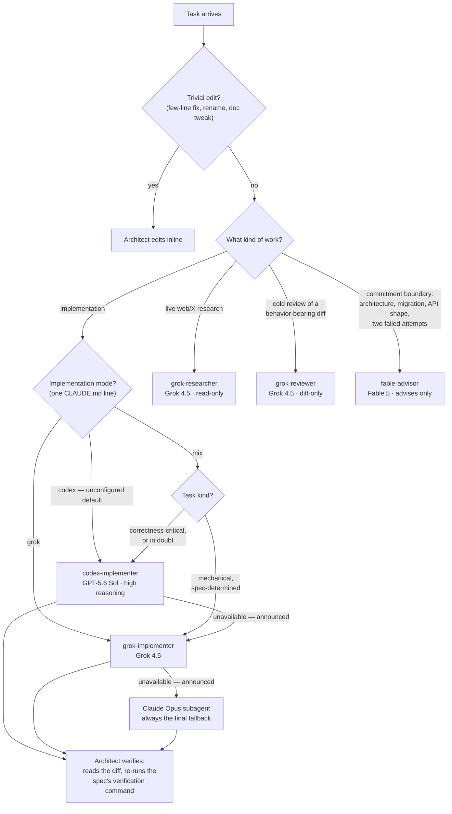

# Fable Advisor

> Forked from [DannyMac180/fable-advisor](https://github.com/DannyMac180/fable-advisor). Same architect pattern; this fork optimizes for fewer subtle bugs over token cost: implementation routing is a declared mode (codex-only when unconfigured, grok-only, or mix — the architect routes per task), lanes are never raced, a Claude Opus subagent is always the terminal fallback, lanes run under a shipped process supervisor, and it adds `grok-researcher` and `grok-reviewer` agents.

**The smartest model runs the show. Cheaper models do the typing.**

Claude Code lets every subagent run on a different model — and lets the session itself run on a different model than its subagents. This plugin exploits that with the **architect pattern**: your session runs on **Fable 5**, Anthropic's most capable model, acting as a full-time architect. It owns requirements, decomposition, specs, and verification — and routes every implementation task to a cheaper cross-vendor lane:

| Lane | Producer | Invocation | Route here when |
|---|---|---|---|
| Implementation | **GPT-5.6 Sol** (high reasoning) | `codex-implementer` agent | All implementation in **codex** mode (the unconfigured default); the correctness-critical share in **mix** mode |
| Implementation | **Grok 4.5** | `grok-implementer` agent | All implementation in **grok** mode; the mechanical, spec-determined share in **mix** mode |
| Research | Grok 4.5 | `grok-researcher` agent | Breadth-first live-web/X research — returns distilled, cited findings. Codebase lookups stay with cheap in-process read-only agents |
| Review | Grok 4.5 | `grok-reviewer` agent | A cold second review lens on a behavior-bearing diff — diff only, no intent framing, every claim cited `file:line` |
| Judgment | Fable 5 | `fable-advisor` agent | Commitment boundaries — see below |

Tokens route by volume: the expensive model emits the fewest tokens (judgment and specs), the CLI producers emit the most (code), and a thin Sonnet wrapper supervises each lane. The CLI lanes don't need to match the architect — they need to be **good enough when the architect owns the hard parts and verifies**; that's the economic case, and it runs far cheaper than Fable-for-everything. Every implementation is *verified* by a different model family than the one that wrote it (the architect reads the diff and re-runs the checks). Cold adversarial review — "what's wrong that the author didn't see?" — is a separate, explicit step via `grok-reviewer`; see the review tiers in the orchestration skill.

Implementation always goes to ONE lane — lanes are never raced on the same spec. Assurance comes from cross-vendor review of the diff, not duplicate implementations. If the default lane is unavailable (service offline, auth failure, usage limit, CLI missing, timeout), the same spec re-routes to the other CLI lane; if both CLI lanes are down, the final fallback is always a Claude Opus subagent. Every fallback step is announced, never silent, and verification does not relax under fallback.

The plugin ships the **orchestration skill** — the routing doctrine that teaches the session when to use each lane, the cost discipline that keeps the expensive model's own token volume minimal (emit judgment not volume, keep context lean, reason once then hand off), the five-part spec contract that makes context-free delegation safe, and the verification rules that keep cheap lanes honest.

## How routing works



Fallbacks mirror by mode: whichever lane was chosen, an unavailable lane re-routes to the other CLI lane if installed, and the Opus subagent is always the terminal fallback — every substitution announced, verification never relaxed.

## Install

```
claude plugin marketplace add mar3co/fable-advisor
claude plugin install fable-advisor@fable-advisor
```

Updating an existing installation to the latest release:

```
claude plugin marketplace update fable-advisor
claude plugin update fable-advisor@fable-advisor
```

Then start your session as the architect:

```
/model fable
```

Verify the lanes before a task needs them:

```
bash scripts/doctor.sh
```

It checks for a timeout binary and validates both CLIs — presence, auth, and model access via one tiny live call per lane — and reminds you which checks Claude Code can only answer via `/model`.

**Lite mode — one file, 30 seconds.** Don't want the full pattern? Copy [`agents/fable-advisor.md`](agents/fable-advisor.md) into `~/.claude/agents/` and keep your session on Sonnet. You get advisor consults at commitment boundaries without the orchestration layer (see "Advisor-only mode" below).

## Choosing your implementation routing

One line in any CLAUDE.md that applies to your session picks the mode — codex is the unconfigured default:

```
fable-advisor: implementation lane = codex
fable-advisor: implementation lane = grok
fable-advisor: implementation lane = mix
```

- **codex** — everything goes to GPT-5.6 Sol at high reasoning. Optimizes for fewer subtle bugs over per-task token savings.
- **grok** — everything goes to Grok 4.5. Cheap typing when your specs are strong.
- **mix** — the architect routes each task by kind: mechanical, spec-determined work (wiring, CRUD, boilerplate) → grok; correctness-critical work (concurrency, auth, migrations, subtle state) → codex; when in doubt → codex.

The skill honors intent over exact syntax — "let the orchestrator pick the implementation model" selects mix just as well. Availability is discovered, not declared: in every mode an unavailable lane falls back to the other CLI lane if it's installed, then always to a Claude Opus subagent, every step announced — you don't need a special mode just because you only have one CLI. Mode changes routing only; the spec contract, verification, and review rules apply identically in all three.

## Requirements

- **Claude Code ≥ 2.1.170** with a subscription that includes Fable 5 (Pro, Max, Team, or Enterprise — all current consumer plans qualify).
- **No Fable access** (e.g. API-key billing)? Use `/model opus` for the session and change `model: fable` → `model: opus` in the advisor file. Same pattern, model tiers shift down one.
- **Codex lane:** the `codex-implementer` agent needs the [OpenAI Codex CLI](https://github.com/openai/codex) installed and authenticated (`npm i -g @openai/codex`, then `codex login`). It invokes **GPT-5.6 Sol** as `gpt-5.6-sol` with `model_reasoning_effort=high`. GPT-5.6 access may be limited during preview; without model access or an authenticated CLI, the agent reports `STATUS: unavailable` and the other lanes remain unaffected.
- **Grok lanes:** the `grok-implementer`, `grok-researcher`, and `grok-reviewer` agents need the [xAI Grok CLI](https://x.ai/cli) installed and authenticated (install from [x.ai/cli](https://x.ai/cli), then `grok login`). They drive **Grok 4.5** headlessly (`grok --prompt-file … -m grok-4.5`). Without it each agent reports `STATUS: unavailable` — never a silent fallback to a Claude model.
- Install at least the CLI for your chosen mode's lane (mix wants both); installing both keeps the cross-vendor fallback chain intact (a missing CLI just fails loudly and the chain moves on — a Claude Opus subagent is always the terminal fallback).
- Heads-up: if a pinned Claude model isn't available on your account, Claude Code silently falls back to your session model — the pattern degrades quietly rather than erroring. If results feel unremarkable, check your plan. (This quiet fallback applies only to Claude model pins — the grok and codex lanes always fail loudly with a structured error.)

Model resolution order in Claude Code: `CLAUDE_CODE_SUBAGENT_MODEL` env var → per-invocation `model` parameter → agent frontmatter → session model.

## What each producer may do

| Producer | Permissions | Consequence |
|---|---|---|
| codex | `--sandbox workspace-write`, never `danger-full-access` | Writes code scoped to the working tree; runs commands inside the sandbox |
| grok | `--permission-mode acceptEdits`, never `--always-approve` | Edits files without prompting but gets no blanket command approval — it may not manage to run your test suite, which is exactly why the wrapper re-runs verification itself |
| both | Launched detached under `scripts/run-lane.sh` with a pure-bash watchdog (no coreutils needed) | Long runs survive the harness's 10-minute foreground tool-call cap, and the wall clock holds even if the supervising agent dies |

## Use it

With the session on Fable, just ask for work — the orchestration skill routes it:

```
Add rate limiting to our public API. Design it, delegate the
implementation, and verify the evidence before you call it done.
```

The architect writes the five-part spec, routes it per your implementation mode, reads the diff and verification evidence when the report comes back, and only then reports done. Behavior-bearing diffs can additionally get a cold second opinion from `grok-reviewer` — an independent model family reading the diff with no design context.

To make the doctrine always-on, add one line to your project's `CLAUDE.md`:

```
You are the architect running the most expensive model — minimize your
own token volume. Delegate all implementation through the orchestration
skill's routing table (never type code yourself), delegate broad codebase
exploration to cheap read-only agents, and verify evidence before
accepting any lane's report.
```

## Commitment boundaries

Even the architect gets a second opinion. The `fable-advisor` agent is a read-only skeptic — consulted before architecture decisions, migrations, API designs, and whenever a problem has resisted two attempts. It reads your actual code and returns a verdict in under 300 words. It never implements. Running it from a Fable session still pays: it sees the code fresh, without your conversation's accumulated assumptions.

## Advisor-only mode (the original pattern)

The inverse arrangement, for when you'd rather keep the session cheap: run the session on Sonnet and consult `fable-advisor` only at commitment boundaries.

```
Migrate our checkout sessions from Postgres to Redis — plan it,
consult your advisor before committing, then implement.
```

A typical consult costs cents. To make it automatic, add to your project's `CLAUDE.md`:

```
Before committing to any architecture decision, migration, or refactor
touching 3+ files, consult the fable-advisor agent and act on its verdict.
```

## FAQ

**Is this Anthropic's "advisor tool"?** No — that's a server-side API feature. These are plain Claude Code subagents plus a skill: readable, editable, no beta flags.

**Does this work on claude.ai?** No — subagent model routing is Claude Code only (CLI, desktop, VS Code, web).

**Why not just run everything on Fable?** You can. It's excellent. It's also the most expensive lane per token, and most of a session's tokens are implementation mechanics the CLI lanes handle well enough once the architect owns the hard parts and verifies the result. Spend the premium where judgment lives.

**Why not race both CLI lanes on high-stakes work?** (Upstream recommends this; the fork removed it.) Racing pays twice for typing plus once more for the judging, and a plausible-looking wrong diff still needs review to catch. A single implementation plus genuinely independent cross-vendor review of the diff buys the same assurance cheaper — and review scales to any diff, raced or not.

**How does this differ from upstream?** Upstream hardcodes grok as the default implementation lane and recommends racing lanes. This fork: implementation routing modes (codex-only by default, grok-only, or mix — the architect routes per task), no racing, a guaranteed Claude Opus terminal fallback with every substitution announced, a shipped process supervisor (`scripts/run-lane.sh`) so long runs survive the harness's 10-minute foreground cap, tiered review doctrine, and the `grok-researcher` / `grok-reviewer` agents.

**Why Grok and GPT-5.6 Sol lanes in a Claude plugin?** Vendor diversity. Models from one family share blind spots; an independent implementation from a different lineage catches what same-family review misses — and with Claude as the architect, *every* diff now gets cross-vendor review for free. The architect stays Claude — the lanes are producers, not judges.

## License

MIT
