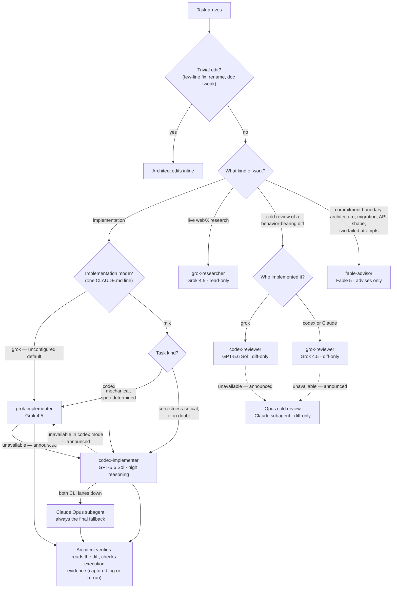

# Fable Orchestrator

**The smartest model runs the show. Cheaper models do the typing.**

Claude Code lets every subagent run on a different model — and lets the session itself run on a different model than its subagents. This plugin exploits that with the **architect pattern**: your session runs on **Fable 5**, Anthropic's most capable model, acting as a full-time architect. It owns requirements, decomposition, specs, routing, and verification — and delegates everything else to cross-vendor lanes:

| Lane | Producer | Agent | Does |
|---|---|---|---|
| Implementation | **Grok 4.5** | `grok-implementer` | All implementation in **grok** mode (the default); the mechanical, spec-determined share in **mix** mode |
| Implementation | **GPT-5.6 Sol** (high reasoning) | `codex-implementer` | All implementation in **codex** mode; the correctness-critical share in **mix** mode |
| Research | Grok 4.5 | `grok-researcher` | Breadth-first live-web/X research, distilled with citations. (Codebase lookups don't come here — in-process read-only agents are faster and more accurate for `file:line` work) |
| Review | Grok 4.5 / GPT-5.6 Sol | `grok-reviewer` / `codex-reviewer` | Cold review of a behavior-bearing diff — diff only, no intent framing, every claim cited `file:line`. Always the family the implementer **isn't** |
| Judgment | Fable 5 | `fable-advisor` | Read-only second opinion at commitment boundaries — see below |

Tokens route by volume: the expensive model emits the fewest (judgment and specs), the CLI producers emit the most (code), and a thin Sonnet wrapper supervises each lane. The CLI lanes don't need to match the architect — they need to be **good enough when the architect owns the hard parts and verifies the result**. That's the economic case, and it runs far cheaper than Fable-for-everything.

## How routing works



Fallbacks mirror by mode: whichever lane was chosen, an unavailable implementation lane re-routes to the other CLI lane if installed, with the Opus subagent as the terminal fallback; an unavailable reviewer falls back to a cold Opus pass (Claude is a third family versus both CLI implementers). Every substitution announced, verification never relaxed, review never silently skipped.

## The rules that keep it honest

- **One lane per task — never race.** Racing pays twice for typing plus once more for judging, and a plausible-looking wrong diff still needs review to catch. Assurance comes from verification plus tiered review of the diff.
- **Verification is not review.** Verification asks "did it do what the spec said, and do the checks pass?" — the architect does it on every diff, with cross-vendor eyes. Cold review asks "what's wrong that the author didn't see?" — a separate reviewer pass, always from the model family that *didn't* write the diff (a same-family reviewer shares the author's blind spots), falling back to a cold Opus pass if that lane is down. Security/auth/concurrency paths add a silent-failure completeness read on a strong Claude model. The orchestration skill carries the full tier rules, the refutation pass, and its bounds.
- **Declared spikes skip review, not verification.** Caller-declared throwaway/prototype work gets verification only — declared, never inferred, restated in the lane report — and spike code promoted toward main re-enters the full review tiers before merge. The named escape valve exists so nobody invents informal downgrades under pressure.
- **Reports are claims, not evidence — but captured logs are.** One authoritative verification run per task: the wrapper accepts the CLI's machine-captured log when it shows the verification command passing as the run's final act, and re-runs the command itself otherwise. The architect spot-checks reports and re-runs at integration points. Lane bugs get a corrected spec, not hand-fixes.
- **Long runs survive.** Lanes launch their CLI detached under `scripts/run-lane.sh` — process-group supervision with a pure-bash watchdog — because the harness caps any foreground tool call at 10 minutes, which would otherwise kill supervision mid-run on exactly the tasks worth delegating.
- **Lanes run in the background.** The architect leaves the Agent tool's background default alone — never passing `run_in_background: false` to hold the turn open — ends its turn with a one-line status, and acts on the completion notification. A sequential dependency is not a reason to lock the user out for a lane's whole wall clock; synchronous waits are the rare, announced exception.
- **A completion without a report is not a success.** The wrapper's structured report — with its reap evidence on implementation lanes — is the architect's only signal that a lane is settled; anything else means a detached CLI process may still be mutating the branch. The architect checks the tree and kills survivors before touching it, and lane wrappers are reused across turns only for follow-ups on the same task, never as a long-lived pipe for many tasks.

## Install

```
claude plugin marketplace add mar3co/fable-orchestrator
claude plugin install fable-orchestrator@fable-orchestrator
```

Then run the setup wizard — it detects your CLIs and any existing configuration, asks three questions (lane mode, user- or project-scope CLAUDE.md, always-on or not), writes the config lines idempotently, and offers to validate the lanes:

```
/fable-orchestrator:setup
```

Then start your session as the architect:

```
/model fable
```

Verify the lanes before a task needs them — checks presence of both CLIs (a missing one is a warning, not a failure), auth and model access via one tiny live call per installed CLI, and prints exactly which plugin and version you're running. With codex fast mode on (see "Codex fast mode" below), the codex check runs at the fast tier and diagnoses a fast-only failure as a warning — the lanes degrade to standard tier — rather than a lane failure. The setup wizard already offers this check as its final step:

```
/fable-orchestrator:doctor
```

(From a repo checkout you can also run the script directly: `bash scripts/doctor.sh`.)

## Update

Pull the latest release — first refresh the marketplace, then update the plugin:

```
claude plugin marketplace update fable-orchestrator
claude plugin update fable-orchestrator@fable-orchestrator
```

## Choose your implementation routing

(`/fable-orchestrator:setup` writes this line for you — this section is the manual path.) Choose one line for any CLAUDE.md that applies to your session — grok is the default when nothing is declared:

```
- fable-orchestrator: implementation lane = grok
- fable-orchestrator: implementation lane = codex
- fable-orchestrator: implementation lane = mix
```

- **grok** — everything goes to Grok 4.5. Cheap typing when your specs are strong, with assurance from verification and the review tiers.
- **codex** — everything goes to GPT-5.6 Sol at high reasoning. Maximum reasoning on every diff, for shops that want fewer subtle bugs over token savings.
- **mix** — the architect routes each task by kind: mechanical, spec-determined work → grok; correctness-critical work (concurrency, auth, migrations, subtle state) → codex; in doubt → codex.

The skill honors intent over exact syntax — "let the orchestrator pick the implementation model" selects mix just as well. Availability is discovered, not declared: you don't need a special mode just because you only have one CLI; an unavailable lane falls back loudly (other CLI lane if installed, then always a Claude Opus subagent). Modes change routing only — the spec contract, verification, and review rules are identical in all three.

### Codex fast mode

One more optional line opts the codex lanes into the Codex CLI's fast service tier (`/fable-orchestrator:setup` can write it too):

```
- fable-orchestrator: codex fast mode = on
```

Absent or `off` means off. When on, both codex lanes — implementer and reviewer, in every lane mode — launch with `service_tier=fast`. Know the trade before turning it on: fast is ~1.5x output speed for ~2–2.5x credit burn (it is never cheaper), and it requires ChatGPT sign-in — API-key auth can't use it. If the fast tier fails at run time, the lane retries once at standard tier and reports the downgrade loudly; doctor checks the fast tier live whenever the line is on. Grok lanes are unaffected.

## Implementer Benchmarks

One observed benchmark (July 2026), for flavor rather than proof — and a deliberate one-off exception to the "never race" rule above, which exists precisely because duplicate implementations are waste in real work: the same two fully spec-determined tasks — a token-bucket rate limiter and a TTL LRU cache, each with a unit-test suite — were dispatched simultaneously to all four lanes with identical six-part specs, each lane in its own isolated git repo. Time runs from dispatch to the lane's commit timestamp, so the CLI lanes' numbers include their wrapper's preflight and settlement — the latency you actually pay when delegating. Every run passed its full test suite under an independent re-run; no lane broke a spec constraint.

| Task | 🥇 Grok 4.5 | 🥈 Claude Opus 4.8 (fallback lane) | 🥉 GPT-5.6 Sol (fast tier) | GPT-5.6 Sol (standard tier) |
|---|---|---|---|---|
| Token-bucket rate limiter + tests | **61s** | 78s (1.3x slower than 1st) | 132s (2.2x slower than 1st) | 159s (2.6x slower than 1st) |
| TTL LRU cache + tests | **82s** | 95s (1.2x slower than 1st) | 164s (2.0x slower than 1st) | 200s (2.4x slower than 1st) |

Caveats that keep this honest: two runs of two small tasks is anecdote, not statistics. Both tasks were mechanical, spec-determined work — exactly what the grok default routes to grok — so codex's reasoning depth wasn't exercised; expect a different shape on concurrency or subtle-state work. The Opus lane ran as a plain subagent with no wrapper, so its number omits wrapper overhead the CLI lanes carry. And codex spent part of its extra wall clock on the most thorough self-review of the four, while Opus wrote the largest test suites — speed was the only score here, not quality, which was indistinguishable across lanes at this task size.

## Make it always-on

(`/fable-orchestrator:setup` writes this for you — this section is the manual path.) Add one standing trigger line to your `CLAUDE.md` (user-level for every project, or per-project). It's gated on the session model, so sessions on other models (e.g. Opus) skip the flow. Pair it with your lane line from "Choose your implementation routing" above unless you want the grok default. Don't restate the doctrine itself in `CLAUDE.md`: it lives in the skill, and copies drift.

```
- When the session model is Fable, without being reminded: non-trivial
  implementation runs the fable-orchestrator architect-as-orchestrator flow —
  invoke the fable-orchestrator:orchestration skill before delegating and
  follow it as authoritative for routing, verification, review tiers, and
  advisor consults.
```

Prefer to keep it manual instead? See "Use it" below — the flow triggers per task just as well.

## Requirements

- **Claude Code ≥ 2.1.170** with a subscription that includes Fable 5 (Pro, Max, Team, or Enterprise — all current consumer plans qualify). No Fable access (e.g. API-key billing)? Use `/model opus` for the session and change `model: fable` → `model: opus` in the advisor file — same pattern, tiers shift down one.
- **Grok lanes** (`grok-implementer`, `grok-researcher`, `grok-reviewer`): the [xAI Grok CLI](https://x.ai/cli), installed and authenticated (`grok login`). Drives **Grok 4.5** headlessly.
- **Codex lanes** (`codex-implementer`, `codex-reviewer`): the [OpenAI Codex CLI](https://github.com/openai/codex) (`npm i -g @openai/codex`, then `codex login`). Invokes **GPT-5.6 Sol** at `model_reasoning_effort=high`; access may be limited during preview.
- Install at least your chosen mode's CLI (mix wants both) — but full assurance wants both regardless of mode: your implementer's opposite family is your cold reviewer. With one CLI, implementation works normally and cold review falls back to an Opus cold pass, announced — note the degraded-path bill: under the grok default that means grok types and Opus reviews, with the review landing on your Anthropic quota. A missing CLI always fails loudly with a structured error — never a silent substitution.
- Heads-up: if a pinned **Claude** model isn't available on your account, Claude Code silently falls back to your session model — that quiet degradation applies only to Claude model pins; the grok and codex lanes always fail loudly. If advisor verdicts feel unremarkable, check your plan.

Model resolution order in Claude Code: `CLAUDE_CODE_SUBAGENT_MODEL` env var → per-invocation `model` parameter → agent frontmatter → session model.

## What each producer may do

| Producer | Permissions | Consequence |
|---|---|---|
| codex (implementing) | `--sandbox workspace-write`, never `danger-full-access` | Writes code scoped to the working tree; runs commands inside the sandbox |
| codex (reviewing) | `codex exec review` with `sandbox_mode` pinned read-only | Derives the diff from a ref itself (no diff file to race); cannot write at all |
| grok (implementing) | `--permission-mode bypassPermissions` + enforced `--deny` rules against the obvious forms of `sudo`, `git push`, `curl`/`wget` | Edits files AND runs commands headlessly, so it runs your verification and commits its own work. bypassPermissions is required for reliability, not a loosening: on 0.2.99 every other mode (including `--always-approve`) auto-cancels shell commands the CLI can't statically classify — loops, `$VAR` expansion, `export` — killing the run at its first real verification command (verified live). The deny rules are the actual enforcement layer and hold under bypass (a denied command errors and the run continues); they are a prefix-matched deny-list, not confinement (equivalent command forms can bypass them, and grok's kernel sandbox does not restrict child processes on macOS today) |
| grok (reviewing) | `--tools read_file,grep,list_dir` allowlist (enforced), MCP bridge tools disallowed | Hard read-only: no shell, no edit tools |
| grok (research) | Allowlist of web + read tools only (`--tools`, names verified live — grok silently accepts unknown tool names, so denylists fail open), MCP bridge tools disallowed | Read-and-report only: no shell, no edit tools |
| all CLI lanes (implement and review) | Launched detached under `scripts/run-lane.sh` (process-group kills, pure-bash watchdog — no coreutils needed) | Long runs survive the 10-minute foreground cap; the wall clock holds even if the supervising agent dies. `scripts/test-run-lane.sh` smoke-tests this without API calls |

## Use it

With the session on Fable, just ask for work — the orchestration skill routes it:

```
Add rate limiting to our public API. Design it, delegate the
implementation, and verify the evidence before you call it done.
```

The architect writes the six-part spec (objective, files, interfaces, constraints, verification, commit ownership — plus an honest `TIMEOUT:` estimate for long tasks), routes it per your mode, reads the diff, verification evidence, and commit hash when the report comes back, sends behavior-bearing diffs to the opposite-family cold reviewer by ref, and only then reports done.

### Without always-on (per-task trigger)

Skipped the always-on trigger? Invoke the flow per task instead — type `/fable-orchestrator:orchestration` followed by your request, or just say so in plain words ("use the fable-orchestrator flow for this"). Routing, verification, and review work identically; the always-on line only saves you the invocation.

## Commitment boundaries

Even the architect gets a second opinion. The `fable-advisor` agent is a read-only skeptic — consulted before architecture decisions, migrations, API designs, and whenever a problem has resisted two attempts. Give it the decision, the constraints, the options, the exact files to read, and the decisive evidence pasted in (it cannot run commands, and it will decline to rule on evidence it wasn't given). It returns a verdict in under 300 words and never implements. Running it from a Fable session still pays: it sees the code fresh, without your conversation's accumulated assumptions.

**Advisor-only mode** — the inverse arrangement, for when you'd rather keep the session cheap: copy [`agents/fable-advisor.md`](agents/fable-advisor.md) into `~/.claude/agents/`, run the session on Sonnet, and consult the advisor only at commitment boundaries. A typical consult costs cents. To make it automatic, add to your project's `CLAUDE.md`:

```
Before committing to any architecture decision, migration, or refactor
touching 3+ files, consult the fable-advisor agent and act on its verdict.
```

## FAQ

**Is this Anthropic's "advisor tool"?** No — that's a server-side API feature. These are plain Claude Code subagents plus a skill: readable, editable, no beta flags.

**Does this work on claude.ai?** No — subagent model routing is Claude Code only (CLI, desktop, VS Code, web).

**Why not just run everything on Fable?** You can. It's excellent. It's also the most expensive lane per token, and most of a session's tokens are implementation mechanics the CLI lanes handle well enough once the architect owns the hard parts and verifies the result. Spend the premium where judgment lives.

**Why not race both CLI lanes on high-stakes work?** (The original fable-advisor recommends this; we removed it.) Racing pays twice for typing plus once more for the judging, and a plausible-looking wrong diff still needs review to catch. One implementation plus genuinely independent cross-vendor review buys the same assurance cheaper — and review scales to any diff, raced or not.

**Why Grok and GPT-5.6 Sol lanes in a Claude plugin?** Vendor diversity. Models from one family share blind spots. Every diff is *verified* by a different family than the one that wrote it, and cold *review* comes from whichever family didn't write the diff. The architect stays Claude — the lanes are producers, not judges.

**How does this relate to DannyMac180's fable-advisor?** This project began as a fork of it and is now maintained independently under its own name. Relative to the original: routing modes instead of a hardcoded default, no racing, a guaranteed Claude Opus terminal fallback, a shipped process supervisor, tiered cross-family review, and the researcher/reviewer agents.

## License

MIT
