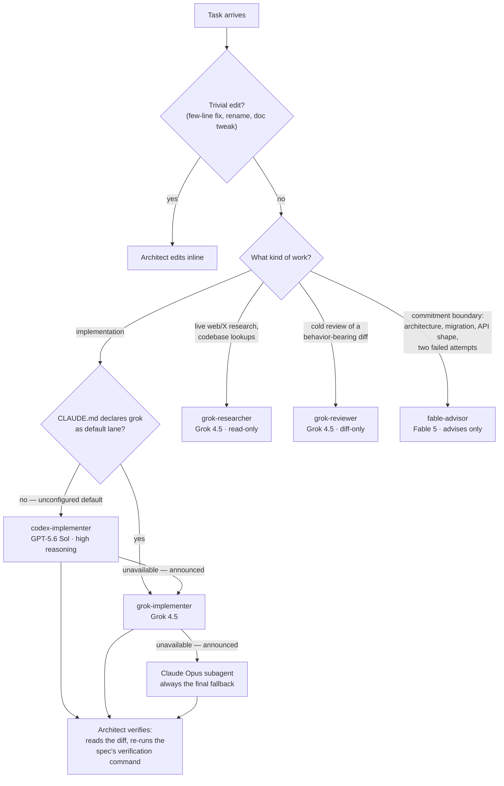

# Fable Advisor

> Forked from [DannyMac180/fable-advisor](https://github.com/DannyMac180/fable-advisor). Same architect pattern and lane mechanics; this fork makes the default implementation lane configurable (codex when unconfigured), never races lanes, guarantees a Claude Opus subagent as the final fallback, and adds `grok-researcher` and `grok-reviewer` agents.

**The smartest model runs the show. Cheaper models do the typing.**

Claude Code lets every subagent run on a different model — and lets the session itself run on a different model than its subagents. This plugin exploits that with the **architect pattern**: your session runs on **Fable 5**, Anthropic's most capable model, acting as a full-time architect. It owns requirements, decomposition, specs, and verification — and routes every implementation task to a cheaper cross-vendor lane:

| Lane | Producer | Invocation | Route here when |
|---|---|---|---|
| Implementation (default) | **GPT-5.6 Sol** (high reasoning) | `codex-implementer` agent | All implementation work, routine or correctness-critical — unless you declared grok your default (see "Choosing your default lane") |
| Implementation (alternate) | **Grok 4.5** | `grok-implementer` agent | You declared grok your default, or the default lane is unavailable |
| Research | Grok 4.5 | `grok-researcher` agent | Breadth-first live-web/X research and mechanical codebase lookups — returns distilled, cited findings |
| Review | Grok 4.5 | `grok-reviewer` agent | A cold second review lens on a behavior-bearing diff — diff only, no intent framing, every claim cited `file:line` |
| Judgment | Fable 5 | `fable-advisor` agent | Commitment boundaries — see below |

Tokens route by volume: the expensive model emits the fewest tokens (judgment and specs), cheap lanes emit the most (code). Implementation mechanics are ~90% of a session's tokens and the CLI lanes handle them at near-parity — so this runs far cheaper than Fable-for-everything, and every implementation comes from a *different model family* than the architect that reviews it: cross-vendor review is built into the routing, not bolted on.

Implementation always goes to ONE lane — lanes are never raced on the same spec. Assurance comes from cross-vendor review of the diff, not duplicate implementations. If the default lane is unavailable (service offline, auth failure, usage limit, CLI missing, timeout), the same spec re-routes to the other CLI lane; if both CLI lanes are down, the final fallback is always a Claude Opus subagent. Every fallback step is announced, never silent, and verification does not relax under fallback.

The plugin ships the **orchestration skill** — the routing doctrine that teaches the session when to use each lane, the cost discipline that keeps the expensive model's own token volume minimal (emit judgment not volume, keep context lean, reason once then hand off), the five-part spec contract that makes context-free delegation safe, and the verification rules that keep cheap lanes honest.

## How routing works



The diagram shows the unconfigured chain (codex → grok → Opus). When your CLAUDE.md declares grok the default, the chain mirrors: grok → codex → Opus. Either way the Opus subagent is always the terminal fallback, every substitution is announced, and verification never relaxes under fallback.

## Install

```
claude plugin marketplace add mar3co/fable-advisor
claude plugin install fable-advisor@fable-advisor
```

Updating an existing installation to the latest release:

```
claude plugin marketplace update fable-advisor
claude plugin update fable-advisor@fable-advisor
```

Then start your session as the architect:

```
/model fable
```

Verify the lanes before a task needs them:

```
bash scripts/doctor.sh
```

It checks for a timeout binary and validates both CLIs — presence, auth, and model access via one tiny live call per lane — and reminds you which checks Claude Code can only answer via `/model`.

**Lite mode — one file, 30 seconds.** Don't want the full pattern? Copy [`agents/fable-advisor.md`](agents/fable-advisor.md) into `~/.claude/agents/` and keep your session on Sonnet. You get advisor consults at commitment boundaries without the orchestration layer (see "Advisor-only mode" below).

## Choosing your default lane

`codex-implementer` (GPT-5.6 Sol) is the default implementation lane when nothing says otherwise. To make Grok the default instead, declare it in any CLAUDE.md that applies to your session — canonical form, one line:

```
fable-advisor: default implementation lane = grok
```

The skill honors intent over exact syntax — any clear statement of lane preference counts (e.g. "grok is my default implementation lane"). The declaration flips the routing only: the other CLI lane becomes the first fallback, the Opus subagent stays the final fallback, and the spec contract, verification, and review rules apply identically to both lanes.

## Requirements

- **Claude Code ≥ 2.1.170** with a subscription that includes Fable 5 (Pro, Max, Team, or Enterprise — all current consumer plans qualify).
- **No Fable access** (e.g. API-key billing)? Use `/model opus` for the session and change `model: fable` → `model: opus` in the advisor file. Same pattern, model tiers shift down one.
- **Codex lane:** the `codex-implementer` agent needs the [OpenAI Codex CLI](https://github.com/openai/codex) installed and authenticated (`npm i -g @openai/codex`, then `codex login`). It invokes **GPT-5.6 Sol** as `gpt-5.6-sol` with `model_reasoning_effort=high`. GPT-5.6 access may be limited during preview; without model access or an authenticated CLI, the agent reports `STATUS: unavailable` and the other lanes remain unaffected.
- **Grok lanes:** the `grok-implementer`, `grok-researcher`, and `grok-reviewer` agents need the [xAI Grok CLI](https://x.ai/cli) installed and authenticated (install from [x.ai/cli](https://x.ai/cli), then `grok login`). They drive **Grok 4.5** headlessly (`grok --prompt-file … -m grok-4.5`). Without it each agent reports `STATUS: unavailable` — never a silent fallback to a Claude model.
- Install at least the CLI for your default lane; installing both keeps the cross-vendor fallback chain intact (a missing CLI just fails loudly and the chain moves on — a Claude Opus subagent is always the terminal fallback).
- Heads-up: if a pinned Claude model isn't available on your account, Claude Code silently falls back to your session model — the pattern degrades quietly rather than erroring. If results feel unremarkable, check your plan. (This quiet fallback applies only to Claude model pins — the grok and codex lanes always fail loudly with a structured error.)

Model resolution order in Claude Code: `CLAUDE_CODE_SUBAGENT_MODEL` env var → per-invocation `model` parameter → agent frontmatter → session model.

## Use it

With the session on Fable, just ask for work — the orchestration skill routes it:

```
Add rate limiting to our public API. Design it, delegate the
implementation, and verify the evidence before you call it done.
```

The architect writes the five-part spec, routes it to the default implementation lane, reads the diff and verification evidence when the report comes back, and only then reports done. Behavior-bearing diffs can additionally get a cold second opinion from `grok-reviewer` — an independent model family reading the diff with no design context.

To make the doctrine always-on, add one line to your project's `CLAUDE.md`:

```
You are the architect running the most expensive model — minimize your
own token volume. Delegate all implementation through the orchestration
skill's routing table (never type code yourself), delegate broad codebase
exploration to cheap read-only agents, and verify evidence before
accepting any lane's report.
```

## Commitment boundaries

Even the architect gets a second opinion. The `fable-advisor` agent is a read-only skeptic — consulted before architecture decisions, migrations, API designs, and whenever a problem has resisted two attempts. It reads your actual code and returns a verdict in under 300 words. It never implements. Running it from a Fable session still pays: it sees the code fresh, without your conversation's accumulated assumptions.

## Advisor-only mode (the original pattern)

The inverse arrangement, for when you'd rather keep the session cheap: run the session on Sonnet and consult `fable-advisor` only at commitment boundaries.

```
Migrate our checkout sessions from Postgres to Redis — plan it,
consult your advisor before committing, then implement.
```

A typical consult costs cents. To make it automatic, add to your project's `CLAUDE.md`:

```
Before committing to any architecture decision, migration, or refactor
touching 3+ files, consult the fable-advisor agent and act on its verdict.
```

## FAQ

**Is this Anthropic's "advisor tool"?** No — that's a server-side API feature. These are plain Claude Code subagents plus a skill: readable, editable, no beta flags.

**Does this work on claude.ai?** No — subagent model routing is Claude Code only (CLI, desktop, VS Code, web).

**Why not just run everything on Fable?** You can. It's excellent. It's also the most expensive lane per token, and most of a session's tokens are implementation mechanics that the cheap lanes handle at near-parity. Spend the premium where judgment lives.

**Why not race both CLI lanes on high-stakes work?** (Upstream recommends this; the fork removed it.) Racing pays twice for typing plus once more for the judging, and a plausible-looking wrong diff still needs review to catch. A single implementation plus genuinely independent cross-vendor review of the diff buys the same assurance cheaper — and review scales to any diff, raced or not.

**How does this differ from upstream?** Upstream hardcodes grok as the default implementation lane and recommends racing lanes. This fork: configurable default (codex unconfigured, grok by one CLAUDE.md line), no racing, a guaranteed Claude Opus terminal fallback with every substitution announced, plus the `grok-researcher` and `grok-reviewer` agents. Lane mechanics (preflight, spec files, flag discipline, structured reports) are unchanged from upstream.

**Why Grok and GPT-5.6 Sol lanes in a Claude plugin?** Vendor diversity. Models from one family share blind spots; an independent implementation from a different lineage catches what same-family review misses — and with Claude as the architect, *every* diff now gets cross-vendor review for free. The architect stays Claude — the lanes are producers, not judges.

## License

MIT
